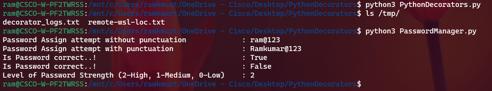

# Python Decorators

#### Name: Ramkumar Murthy

The decorators named `log_message` and writen to the file `/tmp/decorator_logs.txt`.

### Source Code:

PasswordManager.py

```
import string


class BasePasswordManager:
    def __init__(self):
        self.old_passwords = ["ram@123"]

    def get_password(self):
        return self.old_passwords[-1]

    def is_correct(self, password):
        return password == self.get_password()


class PasswordManager(BasePasswordManager):
    def set_password(self, old_password, new_password):
        if not self.is_correct(old_password):
            return False

        if len(new_password) < 6:
            return False

        # check security level of new password
        if self.get_level(new_password) < self.get_level(old_password):
            return False

        self.old_passwords.append(new_password)
        return True

    def get_level(self, password):
        if any(char in string.punctuation for char in password):
            return 2
        elif any(char.isdigit() for char in password):
            return 1
        else:
            return 0


pw = PasswordManager()
pw.set_password("ram@123","Ramkumar123")
wo_punctuation = pw.get_password()
print("Password Assign attempt without punctuation \t\t:", wo_punctuation)


pw.set_password("ram@123","Ramkumar@123")
w_punctuation = pw.get_password()
print("Password Assign attempt with punctuation \t\t:", w_punctuation)

check_true = pw.is_correct("Ramkumar@123")
print("Is Password correct..! \t\t\t\t\t:", check_true)

check_false = pw.is_correct("ram@123")
print("Is Password correct..! \t\t\t\t\t:", check_false)

password_level = pw.get_level("ram@12345")
print("Level of Password Strength (2-High, 1-Medium, 0-Low) \t:", password_level)
```

PythonDecorators.py

```
def log_message(func):
    def wrapper(*args, **kwargs):
     
        result = func(*args, **kwargs)
    
        with open('/tmp/decorator_logs.txt', 'a') as f:
    
            f.write(result + '\n')
     
        return result
    return wrapper

@log_message
def a_function_that_returns_a_string():
    return "A string"

@log_message
def a_function_that_returns_a_string_with_newline(s):
    return "{}\n".format(s)

@log_message
def a_function_that_returns_another_string(string=""):
    return "Another string"

```

### Output:


